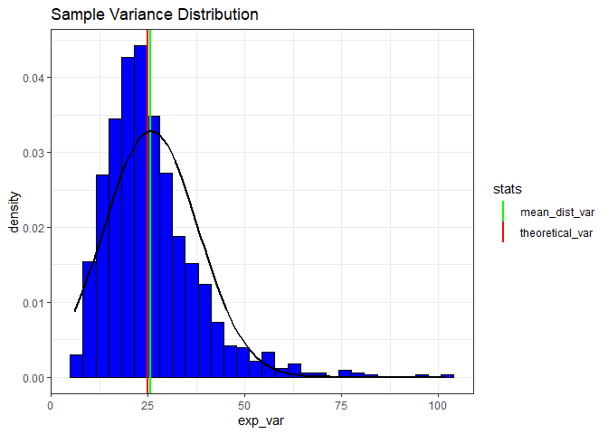

### The following exercise demonstrates the exponential distribution and compares it with Central Limit Theorem. I simulated  many samples of data that is exponentially distributed and computed the means of each sample. I also looked at the variance of each sample and explored the distribution of the means.

First let's look at a single sample exponential distribution. It appears to be left skewed. 


```r
library(ggplot2)
set.seed(37)
sample_size <- 40
num_sim <- 1000
lambda <- 0.2

exp_dist <- rexp(1000, lambda)

exp_df <- data.frame(exp_dist)

e <- ggplot(exp_df, aes(exp_dist)) + 
        geom_histogram(aes(y=..density..),fill='blue', color='black')+
        labs(title='Single Sample Exponential Distribution')+
        stat_function(fun = dnorm, args = list(mean = mean(exp_dist), sd = sd(exp_dist)), col='black',lwd=1)

print(e)
```

<!-- -->

```r
print(paste('Distribution Mean:', mean(exp_dist)))
```

```
## [1] "Distribution Mean: 5.29557639203606"
```

Now let's simulate 1000 samples with sample size of 40 and calculate the mean of each sample. Here I compare the theoretical mean (1/lambda) to the sample mean, showing that they are very close.


```r
exp_means = NULL
for (i in 1:num_sim) exp_means = c(exp_means, mean(rexp(sample_size, lambda)))
means_df <- data.frame(exp_means)

#sample mean vs theoretical mean
p <- ggplot(means_df, aes(x=exp_means)) +
        geom_histogram(aes(y =..density..), fill='blue', color='black')+
        geom_vline(aes(xintercept=1/lambda, color='theoretical_mean'),lwd=1) +
        geom_vline(aes(xintercept=mean(exp_means), color='dist_mean'),lwd=1)+
        stat_function(fun = dnorm, args = list(mean = mean(exp_means), sd = sd(exp_means)), col='black',lwd=1)+
        labs(title='Exponential Means')+
        scale_color_manual(name='stats', values=c(theoretical_mean = 'red', dist_mean='green'))+
        theme_bw()

print(p)
```

<!-- -->

```r
print(paste("Theoretical Mean:", 1/lambda))
```

```
## [1] "Theoretical Mean: 5"
```

```r
print(paste('Sample Mean:',mean(exp_means)))
```

```
## [1] "Sample Mean: 5.02694117979141"
```

Next I will compare the sample variance to the theoretical variance. We can see that the variance is also very close to theoretical variance of (1/lambda)^2. 


```r
exp_var = NULL
for (i in 1:num_sim) exp_var = c(exp_var, var(rexp(sample_size, lambda)))
print(paste('Sample Variance:',mean(exp_var)))
```

```
## [1] "Sample Variance: 25.7952475161769"
```

```r
print(paste('Theoretical Variance:',(1/lambda)^2))
```

```
## [1] "Theoretical Variance: 25"
```

```r
var_df = data.frame(exp_var)
pv <- ggplot(var_df, aes(x=exp_var))+
        geom_histogram(aes(y=..density..), fill='blue', col='black')+
        geom_vline(aes(xintercept=(1/lambda)^2, color='theoretical_var'),lwd=1)+
        geom_vline(aes(xintercept=mean(exp_var),color= 'mean_dist_var'),lwd=1)+
        stat_function(fun = dnorm, args = list(mean = mean(exp_var), sd = sd(exp_var)), col='black', lwd=1)+
        scale_color_manual(name='stats', values=c(theoretical_var = 'red', mean_dist_var='green'))+
        labs(title='Sample Variance Distribution')+
        theme_bw()
print(pv)
```

<!-- -->

Here I demonstrate that the distibution of exponential means is roughly Gaussian/Normally distributed.


```r
q <- ggplot(means_df, aes(sample=exp_means)) +
        stat_qq(alpha=0.37, color='blue')+
        stat_qq_line()+
        labs(title='Normal Distribution Vs. Sample Means Distribution')+
        theme_bw()
print(q)
```

<!-- -->
