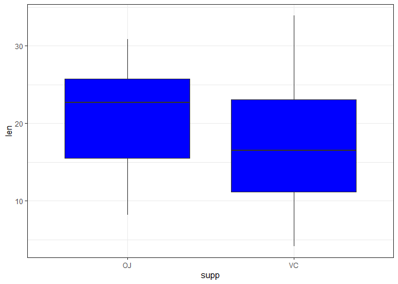
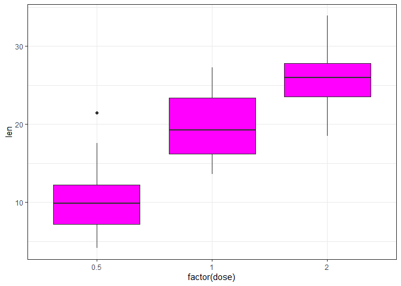
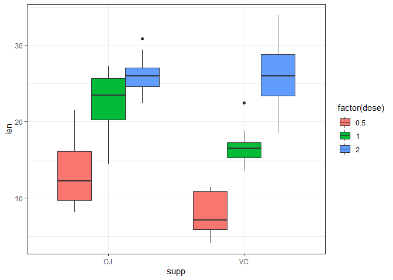

### In the following report I will explore the effects of tooth growth in guinea pigs based on the supplement supplement that was administered and different dosage. 

Here is the overall summary of the data


```r
head(ToothGrowth)
```

```
##    len supp dose
## 1  4.2   VC  0.5
## 2 11.5   VC  0.5
## 3  7.3   VC  0.5
## 4  5.8   VC  0.5
## 5  6.4   VC  0.5
## 6 10.0   VC  0.5
```

```r
summary(ToothGrowth)
```

```
##       len        supp         dose      
##  Min.   : 4.20   OJ:30   Min.   :0.500  
##  1st Qu.:13.07   VC:30   1st Qu.:0.500  
##  Median :19.25           Median :1.000  
##  Mean   :18.81           Mean   :1.167  
##  3rd Qu.:25.27           3rd Qu.:2.000  
##  Max.   :33.90           Max.   :2.000
```

```r
summary(ToothGrowth$len)
```

```
##    Min. 1st Qu.  Median    Mean 3rd Qu.    Max. 
##    4.20   13.07   19.25   18.81   25.27   33.90
```

Here is the visual representation of how each supplement affects the tooth growth. Seems like OJ has an overall better effect although VC has many outliers and more variability.


```r
library(ggplot2)
sb <- ggplot(ToothGrowth, aes(x=supp, y=len))+
        geom_boxplot(fill='blue')+ theme_bw()
print(sb)
```

<!-- -->

Now let's take a look at the overall effect by dosage. Here dose 2 clearly is a better performer.


```r
db <- ggplot(ToothGrowth,  aes(x=factor(dose), y=len))+
        geom_boxplot(fill='magenta')+theme_bw()
print(db)
```

<!-- -->

Here is another look at the data, now I split it into supplement and dose. While dose two seems to be the better choice it's a bit unclear which supplement is the best whith that particular dose.


```r
gb <-  ggplot(ToothGrowth , aes(x=supp, y=len)) +
        geom_boxplot(aes(fill=factor(dose)), position='dodge')+
        theme_bw()
print(gb)
```

<!-- -->

Next I will subset the data to take a look at the dose 2 subjects and explore the mean difference in both supplement groups


```r
oj2 <- ToothGrowth[(ToothGrowth$sup=='OJ') & (ToothGrowth$dose==2),]$len
vc2 <- ToothGrowth[(ToothGrowth$sup=='VC') & (ToothGrowth$dose==2),]$len
```

I will perform an independent two sided t test and set variance to be unequal. The null hypothesis would be both groups have the same mean and the alpha confidence level is 0.05


```r
t.test(oj2, vc2, alternative = 'two.sided', var.equal = F)
```

```
## 
## 	Welch Two Sample t-test
## 
## data:  oj2 and vc2
## t = -0.046136, df = 14.04, p-value = 0.9639
## alternative hypothesis: true difference in means is not equal to 0
## 95 percent confidence interval:
##  -3.79807  3.63807
## sample estimates:
## mean of x mean of y 
##     26.06     26.14
```

After performing the t test we get the p-value of 0.9639 which is very large so we fail to reject the null hypothesis of equal means and come up with the conclusion that dose two is the best performer regardless of the supplement used.
